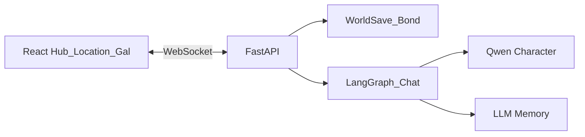

# Companion_Agent — 虚拟生活模拟（GAL + 多角色小镇）

> **学习文档**：[入门](../docs/Agent学习指南-入门版.md) · [进阶](../docs/Agent学习指南-进阶版.md) · [Companion 专篇](学习指南.md)

同一账号下一座小镇世界档：每天去不同地点找 18 位角色聊天/约会，每人独立好感、记忆与对话史（可回退）。React + FastAPI / WebSocket / LangGraph，阿里千问 Character 模型。

## 玩法环

```text
登录 → 标题 → 城镇 Hub（日/时段/心力 · 底栏地图/手机/状态/背包）
  → 出行地点（大立绘选人）
  → 聊天 / 达标后约会（Gal 演出 · 模型控女主）
  → 足迹回退任意一句
  → 结束今天 → 新的一天
```

- **开局身份**：无现成妻子/女朋友；可有前妻、前女友、同学、上司等（[`data/social_graph.json`](data/social_graph.json)）
- **可攻略**：当前 18 位有高质量立绘的角色全部为 romance 线，可慢热至恋爱/结婚（义妹/青梅等仍慢热、尊重界线）
- **性格**：以 MBTI 为主轴；聊天走真人口语
- **活人感（P0～P2 核心已落地）**：双轨日程与缺席；日终旁白与主动消息；节日/约会软拒/便利店礼物；情绪弧；Hub 传闻与长期状态；同场并肩进对话
- **角色间关系边**：聊天后逐渐揭开（秘密边需更高好感）；传闻会点到圈子瓜
- **存档**：`world_saves` 一档全员 Bond；改人设后请**新建世界档**
- 详设见 [`doc/角色活人感与功能增强.md`](doc/角色活人感与功能增强.md)
- **系统总览（推荐先看）**：[`doc/游戏系统框架与玩法.md`](doc/游戏系统框架与玩法.md) — 玩法环、开放后宫、自由对话如何定关系/结局；**§3.1 美德×LLM 三层契约**
- **角色故事与结局（T0/T1/T2）**：[`doc/角色故事与结局圣经.md`](doc/角色故事与结局圣经.md) — 每人独有路线、幕节拍与结局；数据 SSOT `data/story_routes.json`
- **日历叙事 · 结局后续（Phase 2）**：[`doc/日历叙事与结局后续计划.md`](doc/日历叙事与结局后续计划.md) — 航点/关系已落地后的 T1·T2·N 故事加厚、soft/坏结局演出；**不含立绘补图**
- **故事加厚 · Token · 分批立绘**：[`doc/故事与立绘拓展计划-剧本感与Token.md`](doc/故事与立绘拓展计划-剧本感与Token.md) — 当前拍注入 / soft 解耦 / Bond 节拍落盘 / `scene_story_turns=8`；T2 `end_*` 已齐；中立精修可选；**不做** dialog×30
- **立绘扩展（romance 包齐）**：[`doc/立绘资源扩展计划.md`](doc/立绘资源扩展计划.md) — T0 私密+魅力 / T1·T2 魅力已完成；本轮补 T2 结局 CG + 中立轻度精修
- **立绘手册 + 全员缺口**：[`doc/立绘资源手册.md`](doc/立绘资源手册.md) · [`doc/立绘资源缺口.md`](doc/立绘资源缺口.md)（含中立；`python scripts/build_sprite_inventory.py`）
- **开局 / 结局演出 · 场景 · 音乐**：[`doc/开局结局演出与场景音乐.md`](doc/开局结局演出与场景音乐.md) — 序章、全屏结局 CG、BGM 槽位、季节底图
- **引导 · Token · exe/UI**：[`doc/引导缺陷与丰富计划.md`](doc/引导缺陷与丰富计划.md) — 缺陷、剧情引导、18 角权重、**Token 硬上限**、**桌面 exe 与 UI 吸引力**

## 架构



| 层级 | 技术 |
| --- | --- |
| 前端 | React + Vite + TypeScript |
| 虚拟形象 | 纯立绘（情绪 + 服装差分） |
| 后端 | FastAPI + WebSocket |
| 世界状态 | SQLite `world_saves` + `bond_checkpoints` |
| Agent | LangGraph 回合：prepare → llm → grow → memory → persist |

## 快速开始

### 1. 配置环境变量

```bash
cd Companion_Agent
cp .env.example .env
# 编辑 .env，填入 DASHSCOPE_API_KEY
```

**额度注意**：`COMPANION_JUDGE_MODE=hybrid`（或 `llm`）与记忆抽取会调辅模型。`COMPANION_AUX_LLM_MODEL` **留空则与主对话模型相同**（推荐）；不要默写 `qwen-flash`——它常走独立免费额度池，耗尽会 `AllocationQuota.FreeTierOnly`（主对话仍通、好感/记忆发飘）。游戏内会弹出降级提示。桌面 exe 密钥在 `%LOCALAPPDATA%\CompanionAgent\.env`。

### 2. 启动后端

```bash
cd Companion_Agent/backend
pip install -r requirements.txt
uvicorn app.main:app --host 0.0.0.0 --port 13115 --reload
```

### 3. 启动前端

```bash
cd Companion_Agent/frontend
npm install
npm run dev
```

浏览器打开提示的本地地址（默认常为 `http://127.0.0.1:5175`）。先**注册/登录**，再「开始新的一天」。

## 桌面 exe（Windows）

开发预览仍可用浏览器；**发行面**为桌面窗口：

```powershell
cd Companion_Agent
# 可选：先 npm run build（脚本内也会跑）
powershell -ExecutionPolicy Bypass -File desktop/build_exe.ps1
```

产物：`desktop_dist/CompanionAgent/CompanionAgent.exe`（onedir，含前端 dist 与 data）。详见 [`desktop/README.md`](desktop/README.md)。

### 带回家游玩（模型可用）

1. 本机仓库 `.env` 已填 `DASHSCOPE_API_KEY` 时，打包脚本会**首次**复制到  
   `%LOCALAPPDATA%\CompanionAgent\.env`（已有用户文件则不覆盖）。
2. 换电脑：把上述 `.env` 拷过去，或新建并只写一行 `DASHSCOPE_API_KEY=...`。
3. 双击 `CompanionAgent.exe`（**默认窗口化 1280×720**；设置里可切全屏，或启动前设 `COMPANION_FULLSCREEN=1`）；控制台若提示「模型密钥已加载」即可对话。无钥仍可逛 Hub/地点/立绘。
4. 存档也在 `%LOCALAPPDATA%\CompanionAgent\data\`。
5. **立绘大全**：点角色全屏查看；滚轮缩放、拖拽平移；`H` 隐藏侧栏，`F`/`0` 适配窗口，方向键切表情。
6. **BGM**：标题 / Hub / 地点自动播放（设置可关）。曲库为 OpenGameArt CC0 人类作曲纯音乐，见 `data/bgm/ATTRIBUTION.md`。

**Token 默认守门（exe 同 Web）**

| 项 | 默认 |
|----|------|
| 世界对话保留轮数 | ≤4 对（`COMPANION_CONTEXT_KEEP_PAIRS`） |
| Judge | `rules`（不每轮再调裁判模型） |
| 记忆抽取 | **规则每轮 + 实质发言每隔 3 轮 aux**（短敷衍跳过；前 2 轮实质必抽） |
| 摘要 | 每 10 用户轮才调一次廉价 aux |
| TTS | `key_only` + 短句跳过 |

冒烟：`python scripts/smoke-token-budget.py`

- 开发态不打包：`python desktop/launcher.py`（内嵌 uvicorn + pywebview）
- 对话需在 `%LOCALAPPDATA%\CompanionAgent\.env` 放置密钥；无钥仍可逛 Hub / 地点 / 立绘

## 主要 API / WS

| 类型 | 说明 |
| --- | --- |
| `POST /api/auth/register\|login` | 账号 |
| `GET/POST/DELETE /api/world/saves` | 世界存档 |
| `GET /api/world/saves/{id}/hub` | 城镇快照 |
| `GET /api/world/saves/{id}/dates` | 可约会列表 |
| WS `world_start` / `world_travel` / `world_end_day` | 开档、出行、结束今天 |
| WS `enter_talk` / `ask_date` / `chat` / `rollback_turn` | 对话与回退 |

## 内容数据

| 文件 | 用途 |
| --- | --- |
| `data/social_graph.json` | 身份、喜好、时段出没、角色间边 |
| `data/date_catalog.json` | 约会门槛与消耗 |
| `data/model_roles.json` | 人设 / 开场 / 职业 |
| `data/events/*.yaml` | 脚本事件（含 `chance` 随机） |
| `data/endings.json` | 结局条件 |

## 参考开源

| 项目 | 说明 |
| --- | --- |
语音与口型若需扩展，可参考同仓 `AI_Agent`。本仓已去掉 Live2D / VRM，演出只走立绘。

- 立绘选角与量产：[`doc/立绘生成与选角计划.md`](doc/立绘生成与选角计划.md)（标题页「立绘大全 · 选角」）
- **角色活人感 / 功能增强**：[`doc/角色活人感与功能增强.md`](doc/角色活人感与功能增强.md)（P0～P2 核心已落地；立绘批量生成最后再做）
- 中国节日/上班日历：`data/china_calendar_2026.json`（已注入 Hub 与对话 prompt）