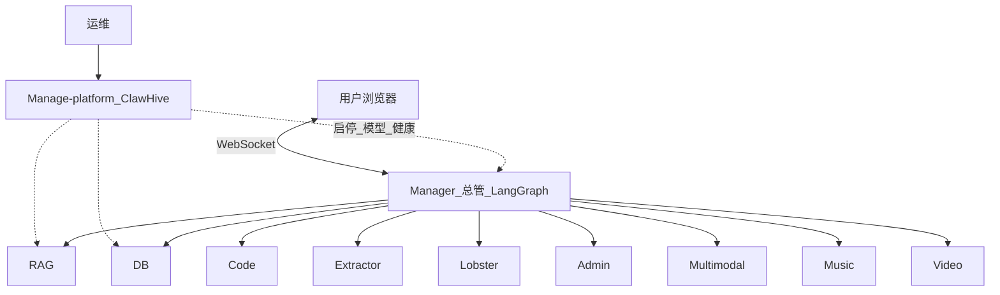

# Agent 开源矩阵

[](https://gitee.com/assssshuhuhuh/agent/stargazers)
[](https://gitee.com/assssshuhuhuh/agent/members)
[](https://gitee.com/assssshuhuhuh/agent)
[](https://gitee.com/assssshuhuhuh/agent)

多服务可运行的 **AI Agent 工程矩阵**：每个专家 Agent 独立目录与端口，由 **Manager** 用 LangGraph 统一编排，**Manage-platform** 提供 Compose 与运维控制台。

覆盖：RAG 知识库 · NL2SQL · 代码助手 · 爬虫 / GUI RPA · 办公助理 · 多模态理解 · 作曲 / 短视频 · 数字人 · 伴侣 / 酒馆 / 校园 Demo。

> 仓库级总览以 **本文件** 为准。各 `*_Agent/README.md` 写该子项目的能力、代码入口与启动方式。较长设计稿默认不进远程仓库。

觉得有用可以 [Star ⭐](https://gitee.com/assssshuhuhuh/agent/stargazers)。

---

## 目录

- [这个仓库是什么](#这个仓库是什么)
- [系统架构](#系统架构)
- [5 分钟跑起来](#5-分钟跑起来)
- [子项目一览](#子项目一览)
- [按目标选目录](#按目标选目录)
- [技术栈与约定](#技术栈与约定)
- [仓库结构](#仓库结构)
- [一键部署](#一键部署)
- [环境与模型](#环境与模型)
- [常见问题](#常见问题)
- [参与贡献](#参与贡献)

注册表边界（Manager 调度 vs ClawHive 技能）：[`docs/registry-boundary.md`](docs/registry-boundary.md)。  
统一登录（ClawHive JWT / 各 UI）：[`docs/unified-login.md`](docs/unified-login.md)。

---

## 这个仓库是什么

本仓库不是单文件 ChatBot Demo，而是 **多进程 / 多容器** 的可联调矩阵：

| 维度 | 说明 |
|------|------|
| **规模** | 14+ 专业 Agent + Manager 总管 + Manage-platform |
| **形态** | 每 Agent 独立目录、独立默认端口；可单开，也可整栈 |
| **协作** | 意图拆解 → 路由 → 规划 → 下游执行 → 结果合成；高风险步骤可 HITL |
| **落地** | Docker Compose、健康探测、ClawHive 模型/启停控制台 |
| **文档** | 根 README 总览；子目录 README 讲「是什么 / 怎么跑 / 代码在哪」 |

**三层分工：**

1. **控制面** — `Manage-platform_Agent`（ClawHive）：Compose/Helm、启停、模型 SSOT、观测  
2. **编排层** — `Manager_Agent`：会话、路由、HITL、合成  
3. **专家层** — RAG / DB / Code / Extractor / Lobster / Admin / 媒体 …  

升级与面试进度见 [`docs/Agent集群升级与面试对照.md`](docs/Agent集群升级与面试对照.md)（工程主轴已收口；口述轨继续）。下一波能力见 [`docs/Agent集群下一波升级-结构与新专家.md`](docs/Agent集群下一波升级-结构与新专家.md)；2026 热度与企业三轴（可维护/可扩展/安全）见 [`docs/Agent前沿热度与企业级竞争力升级.md`](docs/Agent前沿热度与企业级竞争力升级.md)（含 **E1 爆炸半径**、**E5.2 服务身份**、**E7 Agent 形态日志**）。控制面细节见 [`Manage-platform_Agent/doc/企业级控制面升级方案.md`](Manage-platform_Agent/doc/企业级控制面升级方案.md)（P3-CP 默认不开）。

媒体理解（multimodal）与作曲 / 文生视频由总管 **直连** 对应服务，不强制经多模态二次转发。

---

## 系统架构



Manager 主链（简化）：`decompose → route → plan → execute → synthesize → critic`。子句拆解默认开启，关：`MANAGER_CLAUSE_DECOMPOSE=0`。控制面 **不**替代该主链。

---

## 5 分钟跑起来

最小路径：**Manager + RAG**（上传文档 → 带引用问答）。

```bash
git clone https://gitee.com/assssshuhuhuh/agent.git
cd agent

cd Manager_Agent && npm i && cp .env.example .env
cd ../RAG_Agent && npm i && cp .env.example .env
# 两端 .env 填入 OPENAI_API_KEY（或 DashScope 兼容配置）

# 终端 A
cd RAG_Agent && npm run dev          # http://127.0.0.1:13102

# 终端 B
cd Manager_Agent && npm run dev      # http://127.0.0.1:13106
```

验收：在 RAG 上传 PDF/Word → 在 Manager 问文档内容 → 回答应带可追溯引用。

局域网整栈见 [一键部署](#一键部署)。

---

## 子项目一览

更细的启动命令、环境变量与边界见各目录 `README.md`。

### 编排与运维

| 目录 | 星曜（展示名） | 端口 | 一句话 |
|------|----------------|------|--------|
| [Manager_Agent](Manager_Agent/README.md) | **天机** | **13106** | WebSocket 总管：路由 / 规划 / HITL / 注册表 / 进化看板 |
| [Manage-platform_Agent](Manage-platform_Agent/README.md) | **紫微** | **18073**（控制台） | Compose + ClawHive：启停、模型、健康、可选监控 |

```bash
cd Manager_Agent && npm i && cp .env.example .env && npm run dev
```

### 企业向专家（可被 Manager 调度）

| 目录 | 星曜 | cap | 端口 | 一句话 |
|------|------|-----|------|--------|
| [RAG_Agent](RAG_Agent/README.md) | **文曲** | `rag` | **13102** | 私有文档 Hybrid RAG：父子块、引用门禁、澄清/拒答 |
| [DB_Agent](DB_Agent/README.md) | **禄存** | `db` | **13101** | 单库只读 NL2SQL：Schema 接地 + 多路径统计/SQL |
| [CodePy_Agent](CodePy_Agent/README.md) | **武曲** | `code` | **13103** | 轻量代码助手：compute / Diff 确认写盘（旧 Nuxt `code_assistent_Agent` 保留） |
| [Extractor_Agent](Extractor_Agent/README.md) | **巨门** | `crawler` | **13104** | 结构化采集：HTTP/Playwright、质量门禁；总管 SERP 种子精抓 |
| [Lobster_Agent](Lobster_Agent/README.md) | **七杀** | `gui` | **13108** | GUI RPA：plan → act → verify → recover（classic/mcp/auto） |
| [AI_admin_Agent](AI_admin_Agent/README.md) | **天梁** | `admin` | **13105** | 办公助理：天气/地图/日程/邮件（总管仅编排这四类） |

### 媒体

| 目录 | 星曜 | cap | 端口 | 一句话 |
|------|------|-----|------|--------|
| [Multimodal_Agent](Multimodal_Agent/README.md) | **廉贞** | `multimodal` | **13107** | 识图 / ASR / 视频摘要；生成类跳转 Music/Video UI |
| [Music_Agent](Music_Agent/README.md) | **贪狼** | `music` | **13110** | MIDI/BGM 作曲、乐理工具、分轨 |
| [Video_Agent](Video_Agent/README.md) | **破军** | `video` | **13111** | 万相文生视频 + 可选 BGM + ffmpeg 混流 |

### 互动 Demo（相对独立）

| 目录 | 星曜 | 端口 | 一句话 |
|------|------|------|--------|
| [AI_Agent](AI_Agent/README.md) | **太阴** | 后端常见 **8080** | 实时语音数字人（ASR → 对话 → TTS） |
| [Tavern_Agent](Tavern_Agent/README.md) | **天府** | **13109** | 酒品 × 角色行为矩阵人格 Demo |

### shared

`shared/`：跨 Agent 复用代码与约定。单拆某个 Agent 时请确认是否依赖其中模块。

---

## 按目标选目录

| 目标 | 从这里开始 |
|------|------------|
| 知识库问答 | `RAG_Agent` + `Manager_Agent` |
| NL2SQL 问数 | `DB_Agent` |
| 改真实仓库 | `CodePy_Agent`（服务名仍 `code_assistent_agent`） |
| 网页采集 | `Extractor_Agent` |
| 浏览器操作 | `Lobster_Agent` |
| 办公助理 | `AI_admin_Agent` |
| 短视频 | `Video_Agent`（常联动 `Music_Agent`） |
| 数字人 / 互动玩法 | `AI_Agent` / `Tavern_Agent` |
| 内网一键拉起 | `Manage-platform_Agent` |

---

## 技术栈与约定

| 层级 | 选型 |
|------|------|
| 编排 | LangGraph · OpenAI 兼容 LLM · Zod |
| 多数全栈 Agent | Nuxt 4 · Nitro · Vue · WebSocket |
| 部分服务 | FastAPI · React · Vite |
| 数据 / 检索 | MySQL · pgvector · PDF/Word 解析 |
| 自动化 | Playwright |
| 媒体 | ffmpeg · music21 / FluidSynth · 文生视频 API |
| 部署 / 观测 | Docker Compose · ClawHive · LangSmith · 健康与指标 |

**代码约定（全仓）：**

- 业务语义交给模型（Function Calling / Zod JSON），不用关键词表硬路由用户意图  
- 代码层负责工具、状态机、护栏与组装  
- 高风险写操作可暂停确认（HITL）  

---

## 仓库结构

```text
agent/
├── Manager_Agent/           # 总管 13106
├── RAG_Agent/               # 13102
├── DB_Agent/                # 13101
├── CodePy_Agent/            # 13103（compose: code_assistent_agent）
├── code_assistent_Agent/    # 旧 Nuxt 对照/回滚
├── Extractor_Agent/         # 13104
├── Lobster_Agent/           # 13108
├── AI_admin_Agent/          # 13105
├── Multimodal_Agent/        # 13107
├── Music_Agent/             # 13110
├── Video_Agent/             # 13111
├── AI_Agent/                # 数字人
├── Tavern_Agent/            # 13109
├── Manage-platform_Agent/   # Compose + 控制台
├── shared/
├── scripts/
└── README.md
```

每个 `*_Agent` 通常含：可启动服务、前端（如有）、`.env.example`、项目介绍 README。

---

## 一键部署

```bash
cd Manage-platform_Agent
cp .env.agents-lan.example .env.agents-lan
# 编辑 LAN_HOST、API Key、管理员密码、CLAWHIVE_INTERNAL_TOKEN 等

bash scripts/install-linux.sh              # 标准版
bash scripts/install-linux.sh --extended   # 完整版
```

Windows：`scripts/up-agents-lan.ps1`（`-Extended` 启完整栈）。

| 档位 | 内容 |
|------|------|
| **标准版** | 平台 + Manager + DB / RAG / Code / Extractor / Admin / Multimodal + 监控 |
| **完整版** | 标准版 + 音乐 / 视频 / Lobster / 等 |

验收：`http://<LAN_HOST>:18073` 健康总览 → Manager `:13106` 发一条对话。细节见 [Manage-platform_Agent/README.md](Manage-platform_Agent/README.md)。

**公网 / 云服务器（面试演示）**：规格、安全组、`.env` 必填项、Caddy/Nginx 反代与备份清单见 [docs/公网演示部署.md](docs/公网演示部署.md)；反代模板在 [`Manage-platform_Agent/docker/public/`](Manage-platform_Agent/docker/public/)。弱机推荐 `bash scripts/install-linux.sh --no-monitor`。

---

## 环境与模型

- 多数服务支持 **DashScope（百炼）** 或 **OpenAI 兼容** 接口，Key 名见各目录 `.env.example`  
- 本地：各 Agent 各自 `cp .env.example .env`  
- Compose：改平台三层 env（模型 / MODE / 基础设施），再 sync，避免手改十几份配置  
- **不要**提交真实 `.env`、Token、客户数据（已忽略 `**/.env`）

---

## 常见问题

**必须起全部 Agent 吗？**  
不必。最小体验：`RAG_Agent` + `Manager_Agent`；其余按目标按需启动。

**和「只有框架教程」的仓库有何不同？**  
这里是多服务可运行实现 + 编排协议 + Compose 部署；子项目可拆走单开。

**为什么远程看不到 docs / 学习指南？**  
长文设计稿按策略仅本地保留；对外以本 README 与各子目录 README 为准。

**端口冲突？**  
改对应 `.env` 或平台 `.env.agents-lan`，并保持 Manager 注册表 URL 一致。

**能否商用？**  
可作为内网试点与二次开发底座；正式商用请自行评估模型授权、数据合规、许可证与鉴权加固。

---

## 参与贡献

仓库：[Gitee · assssshuhuhuh/agent](https://gitee.com/assssshuhuhuh/agent)

1. Star / Fork  
2. Issue 建议标注：`bug` / `增强` / `文档` / `部署`  
3. PR：优先单 Agent 或明确的 `shared/`；附复现或 smoke；勿提交 `.env`、密钥、`.data/`、构建产物  

维护提示：弃用目录 `Older_Agent` 已移除（由 `Multimodal_Agent` 承接）。根 `.gitignore` 会忽略运行时产物与本地长文。**对外说明优先改本文件与各 Agent README。**

---

## License

许可证文件待补充。使用 / 二次分发前请关注仓库动态，或在 Issue 中询问授权意向。

---

<p align="center">
  <b>可部署、可联调、可拆走单 Agent 的工程矩阵。</b><br/><br/>
  <a href="https://gitee.com/assssshuhuhuh/agent/stargazers">⭐ Star</a>
  ·
  <a href="#5-分钟跑起来">5 分钟体验</a>
  ·
  <a href="#子项目一览">子项目一览</a>
  ·
  <a href="#一键部署">一键部署</a>
</p>

<!-- 关键词：AI Agent, 多智能体, LangGraph, RAG, NL2SQL, Docker Compose, WebSocket, Nuxt, FastAPI -->
